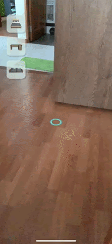
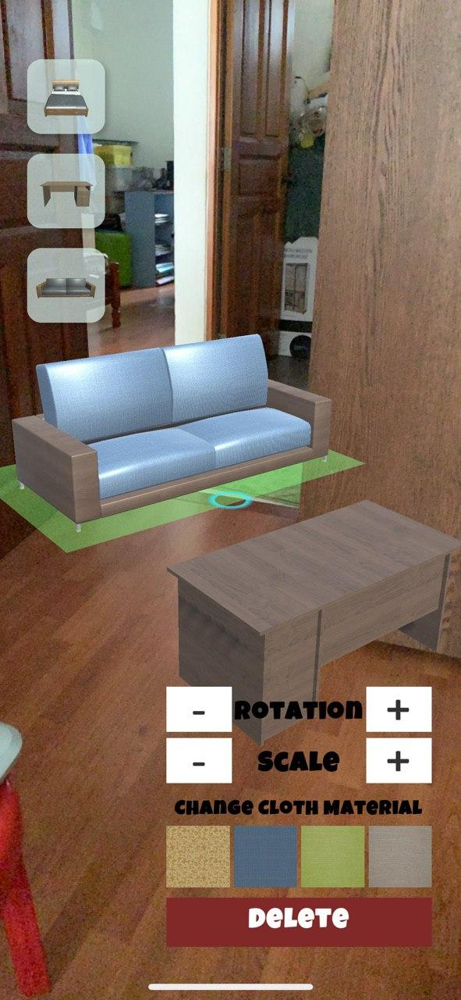
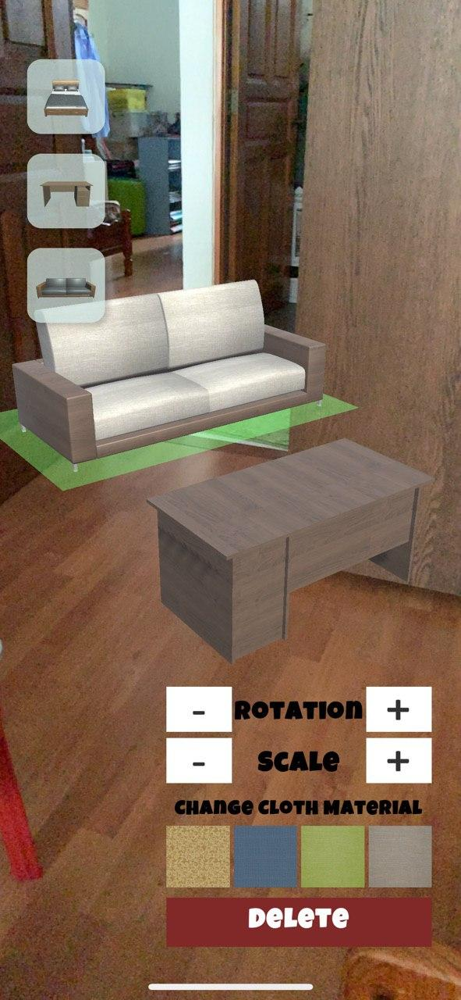

# ARFurnitureApp
A replica of IKEA's AR application, IKEA Place. An exploratory project made with Unity 2019.2.21f1 and ARFoundation. 

Preview of AR Appliation:

 

Features include:
1) Plane detection for placement of furniture onto plane surfaces
2) Rotate and scaling of furniture dynamically while running the application
3) Change material of cloth on the Sofa and Bed that you input
4) Shift furniture but holding down on a selected furniture, and dragging your fingers along to the desired spot

Application was built for iOS devices.

